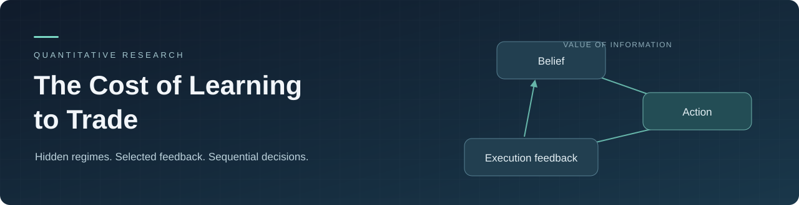
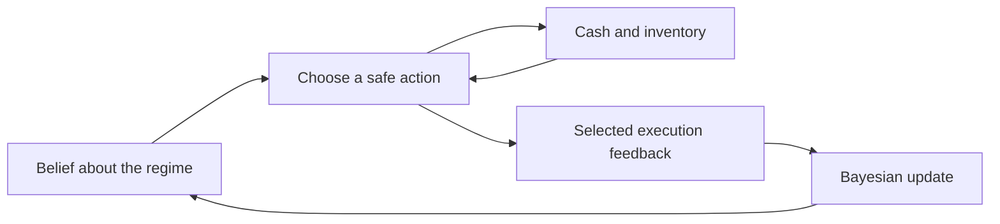
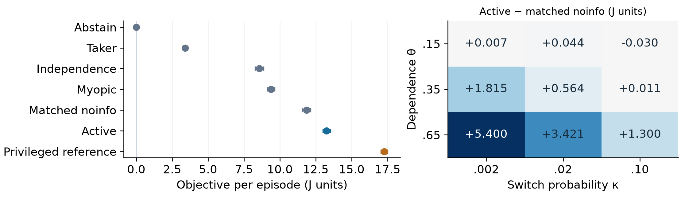

<p align="center">
  
</p>

<h1 align="center">The Cost of Learning to Trade</h1>

<p align="center">
  <strong>When is execution feedback worth paying for?</strong><br>
  A reproducible study of market making, hidden regimes and the economic value of information.
</p>

<p align="center">
  <a href="https://github.com/hlemonnier/the-cost-of-learning-to-trade/actions/workflows/reproduce.yml"></a>
  <a href="LICENSE"></a>
  <a href="pyproject.toml"></a>
  
</p>

<p align="center">
  <a href="output/pdf/Market_Making_Study.pdf">Research paper</a> ·
  <a href="output/pdf/Market_Making_Appendix.pdf">Mathematical appendix</a> ·
  <a href="REPRODUCING.md">Reproduce the study</a> ·
  <a href="extensions/bayes_adaptive/README.md">Bayes-adaptive extension</a>
</p>

## The question

A quote changes inventory and reveals something about the market. Quoting can
therefore be informative even when its immediate economics are unattractive.
Stopping protects the ledger, but also removes execution feedback.

This project studies that trade-off in a fully specified synthetic market.
A hidden regime changes the dependence between fills and returns. The trader
observes public prices and the outcomes of its own orders, and chooses how much
to trade, infer and explore.



## What is here

- **An economic learning bound.** A finite-sample information argument makes the
  cost of identifying a stationary execution environment explicit.
- **Checked sequential control.** Bayesian filtering, Bellman recursions,
  numerical refinement and matched ablations separate inference from planning.
- **Reproducible experiments.** Synthetic pilots, paired evaluation tapes,
  complete ledgers, uncertainty estimates and independent verification.
- **Joint-belief planning.** A separate extension tests the cost of assuming that
  model uncertainty disappears when averaging known-model Q values.

## Results, including the negative finding

These are paired differences in inventory-penalised objective per episode,
in arbitrary synthetic price units. Each study has its own population, horizon
and baseline; the rows should be read separately.

| Study | Primary comparison | Paired mean | 95% interval | Prespecified conclusion |
|---|---|---:|---:|---|
| Hidden-regime study | Active planning − matched noinfo | +1.39256 | [1.29534, 1.48978] | Supports active in the declared nominal synthetic population |
| Bayes-adaptive extension | Joint belief − weighted Q, zero pilot | +0.00450 | [−0.00107, 0.01006] | Meaningful improvement above 0.002 is **not confirmed** |

The first comparison covers 9,000 nominal paired episodes across 90 independent
pilots. Its mechanism study separates forecasting, current inference, inventory
continuation and future-feedback valuation. The extension retains 900,000
policy records on 60,000 paired market trajectories.

<p align="center">
  
</p>

Read the [main report](report/MAIN_REPORT.md) for interpretation and the
[extension paper](extensions/bayes_adaptive/report/Bayes_Adaptive_Extension.pdf)
for the second result. [Evidence and provenance](EVIDENCE.md) explain each check.

## Run a small reproduction

```bash
git clone https://github.com/hlemonnier/the-cost-of-learning-to-trade.git
cd the-cost-of-learning-to-trade
python3.12 -m venv .venv
source .venv/bin/activate
python -m pip install -e .
python verification/verify_pipeline.py --out outputs/reproduction/pipeline
```

Two fresh subprocesses build separate cold caches. The verifier compares all
672 smoke records exactly, checks accounting, legal actions, policy coverage
and posterior resets, and writes
`outputs/reproduction/pipeline/verification.json`.

See [REPRODUCING.md](REPRODUCING.md) for pinned dependencies, raw-data
reconciliation, full runs, PDF builds and resource requirements.

## Explore the repository

| Path | Contents |
|---|---|
| [BENCHMARK.md](BENCHMARK.md) | Market model, information boundary and evaluation design |
| [src/trade_learning/](src/trade_learning/) | Environment, Bayesian filter, control, policies and statistics |
| [report/](report/) | Paper sources, methods and mathematical derivations |
| [verification/](verification/) | Failure-oriented verification and E2E acceptance |
| [outputs/](outputs/) | Ledgers, pilots, plots, tables and numerical evidence |
| [extensions/bayes_adaptive/](extensions/bayes_adaptive/) | Joint-belief solver, protocol and complete paired data |

## Scope

The model uses one asset, a finite action set, Gaussian innovations and selected
feedback. It does not model queue position, latency, partial fills or endogenous
market impact. The stationary lower bound has narrower assumptions than the
switching-regime controller. Numerical convergence is distinct from an optimality
certificate, and synthetic returns do not establish real-market profitability.

## Author and reuse

Hugo Lemonnier. Codex and AI research/coding agents assisted with derivation,
implementation, verification and writing; computational checks and author
judgement remain distinct.

Code and associated project documentation are released under the [MIT licence](LICENSE).
See [CITATION.cff](CITATION.cff) for citation metadata and
[CONTRIBUTING.md](CONTRIBUTING.md) for the research and verification conventions.
