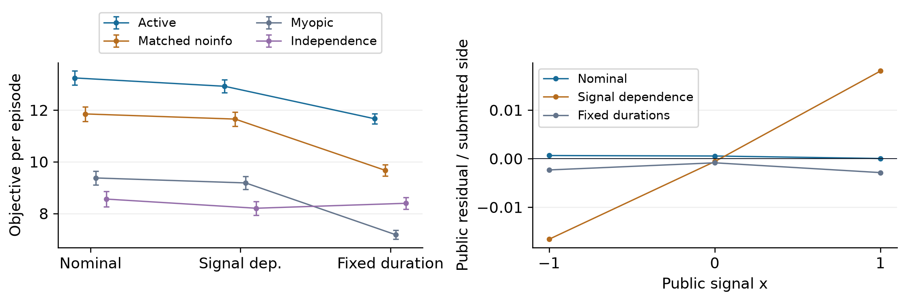

# Main report — text edition for repository review

Generated from the final LaTeX source with numerical inputs expanded. The PDF supplies authoritative pagination; the source and mathematical appendix supply the notation. Figures are the saved report figures.

**The Cost of Learning to Trade**

Market making under hidden execution regimes

Hugo Lemonnier 24 September 2026

*A reproducible study of selected feedback and sequential market making*

# 1. Question, result and scope

Does planning for future regime information improve trading beyond filtering available feedback? This study compares those decisions in the specified synthetic market, using public returns and selected fills. Pilots almost identify the parameter pair: the practical evidence concerns hidden-regime learning with nearly known parameters, not persistent model identification or Bayes-adaptive optimality.

Three conclusions follow. First, at fixed dependence magnitude, the selected fill vector has the same distribution in either sign regime. The informative object is the joint return/fill observation, including non-fills. Second, in a precisely defined stationary reduction, learning to identify the environment with at most 5% error requires at least 15.82 submitted sides in expectation and at least 0.4846 units of expected regret in the bad environment (integral constants evaluated numerically). Third, active information has a positive, directly isolated value in the checked control problem, but its practical economic advantage must be judged against a baseline that also filters and learns from feedback.

The frozen campaign comprises **189,000 policy episodes** on 27,000 paired exogenous trajectories, with 90 independent pilots, nine environments, seven controls and three variants. On the uniform nominal population, active objective is 13.247; its paired advantage over the matched filtering baseline is +1.393 (95% interval \[1.295, 1.490\]). Active net PnL is 15.001. The prespecified one-sided lower advantage bound is 1.312 against an acceptance threshold of .05 objective units. These pilot-aware intervals are empirical, not finite-sample guarantees.

**What is established.** The finite-sample lower bound handles adaptive identification in the reset experiment; it is not a switching-controller regret bound. The restricted control is numerically validated, with separate integration and belief refinements and independent rollouts. The practical policy is a declared approximation evaluated on independent pilots and test episodes. Neither synthetic PnL nor numerical convergence is a claim of executable real-market alpha or certified optimality.

## The specified experiment

An episode has 300 decisions, inventory $`q\in\{-5,\ldots,5\}`$, public signal $`x\in\{-1,0,1\}`$ and eleven pre-mask actions: nine passive quote pairs, a market buy and a market sell. Each passive side is absent, shallow or deep. Actions must be safe for every fill subset. With independent standard normals,
``` math
\begin{align*}
R&=.03x+.30Z,& \rho&=H\theta,\\
p_{s,k}(x)&=(1+e^{.3+.7k+.2sx})^{-1},&
F_{s,k}&=\mathbf1\{\rho sZ+\sqrt{1-\rho^2}U_s\le\Phi^{-1}(p_{s,k}(x))\}.
\end{align*}
```
$`H\in\{-1,+1\}`$ switches with probability $`\kappa`$; the same side noise is used across potential depths. Only selected outcomes enter the learner. The grid is $`\theta\in\{.15,.35,.65\}`$ and $`\kappa\in\{.002,.02,.10\}`$. Half-spread and depth step are .025; passive and market fees are .001 and .002 per unit.

# 2. Observation law and the economic cost of evidence

After acting, $`z=(R-.03x)/.30`$ is observable. For a submitted side, let $`a_{s,k}=\Phi^{-1}(p_{s,k}(x))`$ and $`c_{h,s}=\Phi((a_{s,k}-h\theta sz)/\sqrt{1-\theta^2})`$. At prior $`b=\Pr(H=+1\mid\mathcal I)`$ the conditional fill likelihood is
``` math
\ell_h=\prod_{s\in S(A)}c_{h,s}^{f_s}(1-c_{h,s})^{1-f_s},\quad
B=\frac{b\ell_+}{(1-b)\ell_-+b\ell_+},\quad
b'=\kappa+(1-2\kappa)B.
```
The regime mixture is outside the product. Missing sides contribute nothing; submitted non-fills contribute evidence. Empty products give $`B=b`$, followed by prediction toward one half. Stable log-CDFs and log-sum-exp avoid tail underflow. Substituting $`z\mapsto-z`$ in the fill-vector density proves its invariance to $`H\mapsto-H`$. At fixed $`\theta`$, returns or fills alone do not identify $`H`$. Two-side fills can nevertheless reveal unknown dependence magnitude.

## A reduction with an explicit learning cost

Fix $`x=0`$, $`\theta=.35`$, an unknown permanent $`H=+1`$ (bad) or $`H=-1`$ (good), fresh innovations each opportunity and a reset to zero cash/inventory. Keep all eleven actions and liquidate after each one-period opportunity. Cash/position histories and current returns remain observable; no regime labels or external training evidence are supplied. The signal chain, switching and inventory carry are explicitly removed. The pre-decision risk penalty is therefore zero.

For a quote depth $`k`$, write $`v_k=.025+.025k-.001`$ and $`p_k=g(-.3-.7k)`$. Its expected spread less adverse selection in the bad environment is $`v_kp_k-.105\phi(\Phi^{-1}p_k)`$. Every submitted side costs at least
``` math
c_0=\min_k\{.105\phi(\Phi^{-1}p_k)-v_kp_k\}=.02147136
```
before nonnegative liquidation cost. When both sides fill, their contemporary selection and liquidation contributions cancel; the two-sided action still has negative expected selection across all its outcomes. Abstention is optimal in the bad environment; profitable quoting is available in the good one. The attainable comparator repeats the environment-specific best one-period action.

Let $`I_k`$ be the KL divergence of the *observed return and selected Bernoulli fill* between the two worlds. Conditional on the observed $`z`$, side divergences add; $`I_0=.1674822`$, $`I_1=.1483586`$. Let $`N_k`$ count submitted sides at depth $`k`$, including non-fills, $`N=N_0+N_1\le2n`$, and $`D_a=\sum_{s\in S(a)}I_{k_s}`$. For any adaptive policy, the action kernels cancel at the same public history, giving
``` math
\operatorname{KL}(P_0^\pi\Vert P_1^\pi)=\mathbb E_0\sum_tD_{A_t}
=I_0\mathbb E_0N_0+I_1\mathbb E_0N_1.
```
An identification error at most $`\delta`$ in each world implies KL at least $`\beta_\delta=(1-2\delta)\log((1-\delta)/\delta)`$ by binary data processing \[1\]. Thus $`\mathbb E_0N\ge\beta_\delta/\max_k I_k`$. Defining $`\eta=\min_{a:D_a>0}[-r_0(a)]/D_a`$, every informative action also satisfies $`-r_0(a)\ge\eta D_a`$, and uninformative market actions cost money. Expected regret against optimal abstention is $`\mathcal R_0^\pi(n)=-\mathbb E_0\sum_t r_0(A_t)`$; hence
``` math
\boxed{\mathcal R_0^\pi(n)\ge\eta\beta_\delta.}
```
At $`\delta=.05`$, $`\eta=.182881`$ and the bound is .484634. A completely explicit Gaussian data-processing bound gives the weaker .203791. These are expected costs in the named reduction, not losses on every trade, a switching-model regret rate, or a claim that eight opportunities (the necessary integer lower bound) suffice. The appendix gives the proof, all-action table and an identification experiment.

# 3. Control, accounting and a verified numerical reference

With $`W=C+qP`$, signed executions $`\Delta q`$ and immediate cash gain relative to midpoint $`G`$, the exact marked-wealth identity is
``` math
W_{t+1}-W_t=G_t+q_{t+1}R_t,\qquad
\Pi_T=\sum_{t<T}(G_t+q_{t+1}R_t)-.027|q_T|.
```
The objective subtracts $`.002\sum q_t^2`$ using *pre-decision* inventory. This utility penalty never debits cash. Both-side fees and terminal liquidation are charged once; abstention preserves existing exposure.

Translation invariance and the absence of cash constraints make $`(m,q,x,b)`$ a sufficient known-parameter control state. For $`m`$ remaining decisions,
``` math
V_0=-.027|q|,\qquad
V_m=\max_{a\in\mathcal A(q)}\mathbb E\{G+q'R-.002q^2+
\textstyle\sum_{x'}K_{xx'}V_{m-1}(q',x',b')\}.
```
Expected immediate rewards use exact Gaussian moments; only continuation uses Gauss–Hermite quadrature and linear belief interpolation. Sparse transition operators keep the finite-horizon calculation tractable.

**Matched no-information-value planning.** Replace the feedback posterior $`B`$ by $`b`$ inside continuation, retaining the same economics and inventory transitions. Both runtime policies still filter actual feedback before their next decision. The baseline’s internal non-learning planning value is therefore not its realised filtered-policy value. At fixed magnitude, fill-vector sign invariance implies $`\mathbb E[B\mid F]=b`$; convex continuation makes the same-continuation value of feedback nonnegative in the exact known-parameter problem.

**Reduced reference.** For $`T=30`$, $`|q|\le2`$, $`(\theta,\kappa)=(.35,.02)`$, belief and quadrature refinements were tested separately under fixed tolerances. At 321 beliefs and 161 nodes, initial active value is .9895588. The final belief refinement changes it by $`9.60\times10^{-5}`$ and the final integration refinement by $`5.12\times10^{-6}`$; neither changes a robust action choice. These are stability diagnostics, not certified continuous-state error bounds.

<div class="center">

| Policy               | Evaluated $`J`$ (MC SE) | Initial planner value |
|:---------------------|------------------------:|----------------------:|
| Active               |       0.98660 (0.01601) |               0.98956 |
| Matched noinfo       |       0.95649 (0.01631) |               0.73003 |
| Myopic               |       0.83635 (0.01341) |                     – |
| Privileged reference |       1.45179 (0.01560) |               1.47199 |

</div>

*Rollout values use 20,000 paired independent episodes; parentheses denote Monte Carlo standard errors. The full-information reference sees current $`H`$ only.*

At $`(m,q,x,b)=(30,0,0,.75)`$, the active policy selects two deep quotes with expected immediate reward $`-.0082932`$. Suppressing only the current feedback’s valuation while holding the same active continuation selects abstention. The active action’s total Q advantage is .0034968. This controlled state illustrates a real information sacrifice; it was selected after solving and is not a separate statistical test.

# 4. Finite-pilot learning and independent evaluation

Each of the nine nominal environments supplies ten independent pilot datasets, each containing exactly 100 episodes of 300 decisions. The behaviour policy is uniform over *currently admissible* actions, with probabilities logged. The learner receives public states, actions and selected outcomes; simulator labels, counterfactual fills, seeds and environment identifiers remain in the evaluator.

**Inference.** The declared prior is uniform on the public nine-point parameter grid. For each candidate $`j`$, exact HMM filtering accumulates the likelihood of the permitted pilot observations. Let $`w_j`$ be its posterior weight and $`b_j`$ its conditional regime belief. At each new observation, update $`w_j`$ by its marginal likelihood, update $`b_j`$ by Bayes’ rule, then predict with candidate $`\kappa_j`$. All computations retain log model weights. Every final episode starts from a fresh copy of the same pilot posterior and $`b_j=1/2`$. Learning is allowed within that episode and never accumulates across evaluation episodes.

**Practical controller.** Precompute known-model tables for every publicly declared candidate and choose
``` math
\widehat a=\arg\max_{a\in\mathcal A(q)}\sum_{j=1}^9w_jQ^{\rm active}_{j,m}(q,x,b_j,a).
```
This posterior-weighted approximation values future regime feedback inside each model. Each model’s continuation optimizes its own future decisions, implicitly allowing future model-specific knowledge. This optimistic relaxation neither solves joint Bayes-adaptive control nor values future parameter identification correctly. Replanning and parameter updates remain available. The matched ablation replaces only $`Q^{\rm active}`$ by $`Q^{\rm noinfo}`$, keeping estimator, data, risk, actions and numerical resolution identical. Grid-specific tables are public-prior computation, not additional samples from the hidden target environment.

The other controls are abstention; an inventory-planning taker with market orders only; a planner assuming independent return/fills ($`\theta=0`$); a filtered myopic controller using a one-decision objective including liquidation; and the privileged known-parameter, current-regime reference. The identification map below distinguishes matched treatments from compound controller differences.

**Frozen numerical settings.** Practical tables use 641 beliefs and 161 quadrature nodes; public candidate $`(.65,.002)`$ uses 1,281 beliefs for both matched modes. All eighteen families pass refinement at every remaining horizon; earlier failures remain saved. Float64 decisions use the lowest admissible action ID within $`10^{-12}`$ absolute score units of the maximum, in Bellman values and execution.

**Replication and inference.** Each pilot is followed by 100 fresh episodes per policy in each of three variants. This yields 1,000 episodes per parameter pair, policy and variant, or 189,000 policy episodes on 27,000 exogenous trajectories. Paired exogenous streams are shared across policies, never as policy input. Pilot, debug and final streams are separate. The corrective replay retains the original seeds with the numerical contract fixed before rerunning; it adds no independent statistical sample.

Uncertainty uses paired episode differences aggregated within independently fitted pilots. Student intervals across pilot means retain training-sample variation; within-pilot Monte Carlo variance is reported separately. The uniform nine-environment mixture uses stratified variance and Welch–Satterthwaite degrees of freedom. These are empirical approximations with only ten pilots per environment. One primary comparison was fixed; supplementary contrasts also have family-adjusted intervals.

# 5. Nominal performance and attribution

The same policy is evaluated everywhere. Its uniform-mixture objective is 13.247, versus 11.854 for the matched baseline and 17.256 for the privileged reference. Of nine family-adjusted paired intervals, 4 are entirely positive and 0 entirely negative. This does not imply a uniform advantage.

<div class="center">

| $`\theta`$ | $`\kappa`$ | Active | Noinfo | Myopic | Privileged | $`\Delta J`$ \[adjusted CI\] |
|---:|---:|---:|---:|---:|---:|:---|
| 0.15 | 0.002 | 9.220 | 9.213 | 6.933 | 9.807 | +0.007 \[-0.253, 0.267\] |
| 0.15 | 0.02 | 8.808 | 8.765 | 6.834 | 9.830 | +0.044 \[-0.209, 0.296\] |
| 0.15 | 0.1 | 8.620 | 8.650 | 7.086 | 10.367 | -0.030 \[-0.104, 0.044\] |
| 0.35 | 0.002 | 13.938 | 12.123 | 8.920 | 15.867 | +1.815 \[0.996, 2.635\] |
| 0.35 | 0.02 | 12.012 | 11.447 | 8.890 | 16.381 | +0.564 \[-0.188, 1.317\] |
| 0.35 | 0.1 | 9.355 | 9.343 | 7.972 | 16.249 | +0.011 \[-0.399, 0.422\] |
| 0.65 | 0.002 | 23.946 | 18.546 | 14.641 | 25.985 | +5.400 \[3.818, 6.982\] |
| 0.65 | 0.02 | 19.454 | 16.033 | 12.035 | 25.125 | +3.421 \[2.464, 4.378\] |
| 0.65 | 0.1 | 13.868 | 12.568 | 11.079 | 25.693 | +1.300 \[0.297, 2.302\] |

</div>

*Penalised objective per 300-decision episode. The last column is the paired active-minus-noinfo mean and Bonferroni-adjusted interval for the 162-comparison family at nominal 95% coverage under the Student approximation. No configuration is selected as the winner.*

**Matched mechanism study (reduced model).** A separately frozen study uses 20,000 fresh paired episodes, seven policies and four planned contrasts.

<div class="center">

<table>
<thead>
<tr>
<th style="text-align: left;">Channel</th>
<th style="text-align: left;">Decision intervention</th>
<th style="text-align: left;"><span class="math inline"><em>Δ</em><em>J</em></span> [simultaneous 95%]</th>
</tr>
</thead>
<tbody>
<tr>
<td style="text-align: left;">Forecast</td>
<td style="text-align: left;">Remove only <span class="math inline"><em>μ</em><em>x</em>𝔼[<em>q</em><sup>′</sup>]</span> from every noinfo planning reward; keep <span class="math inline"><em>X</em></span> in fills and the true filter.</td>
<td style="text-align: left;"><span class="math inline">+0.1907</span><br />
<span class="math inline">[0.1561, 0.2253]</span></td>
</tr>
<tr>
<td style="text-align: left;">Current inference</td>
<td style="text-align: left;">Same noinfo table; route <span class="math inline">.5</span> instead of the selected-feedback posterior into each decision.</td>
<td style="text-align: left;"><span class="math inline">+0.2416</span><br />
<span class="math inline">[0.2142, 0.2690]</span></td>
</tr>
<tr>
<td style="text-align: left;">Inventory</td>
<td style="text-align: left;">Same noinfo continuation; replace <span class="math inline"><em>q</em><sup>′</sup></span> by <span class="math inline"><em>q</em></span> for <span class="math inline"><em>m</em> ≥ 2</span>. Preserve exact last-step scores.</td>
<td style="text-align: left;"><span class="math inline">+0.0854</span><br />
<span class="math inline">[0.0569, 0.1140]</span></td>
</tr>
<tr>
<td style="text-align: left;">Future feedback</td>
<td style="text-align: left;">Active versus noinfo; change only feedback conditioning in future planning. Both filter at runtime.</td>
<td style="text-align: left;"><span class="math inline">+0.0262</span><br />
<span class="math inline">[0.0092, 0.0432]</span></td>
</tr>
</tbody>
</table>

</div>

The first three rows compare filtered noinfo with the named ablation. All retain the same true simulator, accounting, constraints and final liquidation. Intervals use paired-episode Student inference adjusted for these four contrasts; this separate family leaves the canonical primary and 162 contrasts unchanged. Effects are not additive. Inventory continuation includes downstream forecast opportunities; it is not a pure risk-cost effect. The appendix defines every intervention, including the inventory-off rule’s deliberately suppressed continuation argument, and gives cold-repeat and independent ledger checks.

The exact ledger separates passive spread capture, execution fees, market spread, terminal liquidation, directional exposure and contemporaneous passive selection. Directional exposure includes inherited-inventory returns and predictable returns on new executions. Passive selection is $`\sum\Delta q_t^{P}(R_t-.03X_t)`$; predictable market orders have a separately reported innovation term. The inventory penalty is additional utility cost. Active nominal mean spread capture is 4.502, passive selection +6.649, directional exposure +5.425, passive fees 0.123, liquidation cost 0.035, and inventory penalty 1.755. The empirical 5th PnL percentile is -3.883, with mean below it -8.617; tail estimates have limited precision. Complete fees, turnover, bid/ask fills, action frequencies and exposure are saved for all 189 cells.

# 6. Misspecification, observable diagnostics and failure

Both stress experiments keep the nominally fitted starting state and all declared online updates. Stress observations do not refit the initial posterior or tune or select policies; they enter the permitted within-episode updates. State dependence uses $`H\theta(1+.25X)`$; fixed durations use 50-period spells with a hidden uniform initial phase. Nominal mean spell length is $`1/\kappa`$: at $`\kappa=.002`$, 500 becomes 50. That case changes duration shape, mean switching rate and opportunities together. Reported $`\kappa`$ labels training. The retained return and fill marginals are checked in all nine configurations and three variants.

Signal dependence: active 12.924, noinfo 11.655, myopic 9.184 objective units. Fixed durations: active 11.668, noinfo 9.674, myopic 7.182 objective units. These are separate frozen-policy experiments.

<div class="center">



</div>

*Left: uniform environment-mixture objective under the two separate stresses. Right: the active learner’s public execution/return residual by signal (descriptive, pooled over the fixed grid); zero is its model prediction.*

An online residual uses only selected outcomes and observed returns:
``` math
e_t=\sum_{s\in S(A_t)}sf_s z_t+
\mathbb E[\rho_t\mid\mathcal I_t]\sum_{s\in S(A_t)}\phi(a_{s,k_s}(X_t)).
```
Correct prediction makes the residual conditionally mean-zero. Log scores depend on action mix and entropy; label-based scores are retrospective. These diagnostics have no calibrated alarm rate or detection power. No quotes means no new execution evidence.

In nominal/signal-dependent/fixed-duration order, active classification error during the first ten periods after a switch is 46.2/46.3/57.9%; its mean longest gap without quotes is 10.0/10.0/11.6 periods. Signal-dependent public residuals at $`x=-1,0,1`$ are -0.0166, -0.0006, +0.0181. Residuals use public feedback; switch errors require hidden labels. The plot supplies the nominal comparison.

Matched noinfo’s mean longest quote gap is 36.3 periods nominally and 47.6 under fixed durations: avoiding quotes slows access to evidence. The fixed-duration public residual remains much closer to zero than the signal-dependent residual, despite worse hidden-state errors; this pooled monitor alone misses much of that failure.

**Failure illustration (retrospective).** The largest observed active deterioration occurs under fixed durations after training at $`(\theta,\kappa)=(0.65,0.002)`$: $`J`$ changes from 23.946 to 14.542 (-9.404). Hidden-label Brier error changes from 0.029 to 0.230; wrong high-confidence predictions from 2.31% to 22.06%. This selected diagnostic illustrates vulnerability; it is not a prespecified hypothesis test or policy-selection rule.

The decline is descriptive, not an isolated cost of duration shape or filtering inefficiency. The privileged reference retains nominal dynamics; its stress curves are not stress-environment oracle optima.

# 7. Deployment decision and limits

Before final evaluation, the candidate was fixed as active, the baseline as matched noinfo, and the population as a uniform mixture of the nine nominal environments with fresh independent 100-episode pilots. The economic threshold is .05 additional penalised-objective units per episode, approximately one market round-trip spread and fee cost (.054). Acceptance requires the one-sided 95% lower bound for that paired advantage to exceed .05 and the corresponding lower bound for active net PnL to be positive. This is a synthetic policy-selection assessment.

**Decision: prefer active within the nominal synthetic population.** Active-minus-noinfo mean is +1.3926, with paired 95% interval \[1.2953, 1.4898\] and one-sided 95% lower bound 1.3116. The latter exceeds the fixed .05 threshold. Active net PnL has one-sided lower bound 14.777. This rule assesses a fresh nominally generated 100-episode pilot and the uniform nine-point stationary population. It gives no approval for either misspecified process or real-market trading.

For other independent evaluations of this same frozen design, an advantage upper bound below .05 supports retaining the baseline. Bounds spanning the economic threshold leave the benefit unresolved; failure to establish positive net PnL also prevents acceptance. The operational fallback is the baseline in either non-acceptance case. Only fresh, prespecified evidence can resolve that uncertainty; repeated inspection of the same outcomes cannot.

The primary candidate was not selected from whichever policy or environment won after inspection. Per-environment and additional policy differences are labelled supplementary; their saved intervals additionally adjust for the full family of 162 contrasts. Repeated comparisons do not become independent experiments merely because many ticks are available. Episode outcomes remain correlated through a common fitted pilot, which is why uncertainty is computed at that level.

## Material limits

1.  The finite-grid prior gives the correct nominal support by construction. The method can be strongly confident in a misspecified family; exact filtering within that family does not make it correct under stress. All 90 pilots put at least 96.86% posterior mass on the true pair (evaluator-only diagnostic). This study therefore gives limited evidence about persistent parameter uncertainty.

2.  Posterior-weighted known-model planning is not joint Bayes-adaptive control. Its matched ablation isolates the specified regime-information planning component, not every possible exploration mechanism or parameter-learning advantage.

3.  Numerical refinement is empirical. The worst practical family required a much finer belief grid; stability of action choices and value drift are reported separately. No rigorous continuous-belief approximation bound is claimed.

4.  Ten independent pilots per environment support an empirical uncertainty assessment, with limited precision for rare training failures and tails. Gaussian innovations make rewards unbounded. No bounded-reward concentration theorem or protection against arbitrary future regime change is invoked.

5.  The environment deliberately excludes queues, latency, impact, partial fills and intra-period cancellation. There is no exchange calibration, real-market data, live order placement or evidence of executable commercial profitability.

The reset experiment proves an identification cost. The switching study evaluates future regime-information planning against a filtering baseline after near-identification of the parameter pair. It establishes neither joint Bayes-adaptive optimality nor an isolated causal explanation of stress losses.

# 8. Reproduction, verification and attribution

The repository contains the model, inference/control code, evaluator, verification programs and saved data. The manifest binds source, specification, seeds and numerical builds. Install the pinned dependencies using `REPRODUCING.md`; then run the small check:

    PYTHONPATH=src .venv/bin/python verification/verify_pipeline.py

This checks identical episode tables and table fingerprints from two processes with separate cold caches. Full cold-run commands and resource limits are in the guide. Recorded source identities are retained; cache integrity and incomplete-data/configuration rejection are checked. Optional multi-asset, Hawkes, deep-RL and exchange-connectivity extensions remain unimplemented.

The corrective full campaign, starting with an empty cache, took 42.3 minutes on ARM macOS with 10 reported logical CPUs; measured table-build times sum to 192.3 seconds. Python 3.12.14, NumPy 2.5.3 and SciPy 1.18.1 accompany the frozen code hash. The maximum final cash/wealth discrepancy was 1.66e-11. All 90 pilot datasets and 450 stream identifiers were reconciled to the manifest.

A fresh central-model $`T=300`$, $`Q_{\max}=5`$, 641-belief/161-node active table peaked at 3.38 GiB process RSS and wrote 583 MiB. Use a dedicated 16 GiB host and 30 GiB free disk as a conservative working envelope, not a measured minimum; the full-run peak was not measured. The reproduction guide separates smoke verification from full cold computation.

- Environment: exhaustive safe actions and signed executions, fees/liquidation, public feedback, depth consistency, uniform behaviour and 3.24 million validation periods.

- Inference: hidden-path enumeration, extreme likelihoods, independent resets and evaluator calibration.

- Theory: complete derivation, independent quadrature and raw-noise ledgers; integral evaluations are not certificates.

- Control: scalar integration, symmetry, convexity, mass, information dominance, separate refinements, serialization and independent rollouts.

- Integration: frozen source, separate streams, pilot/posterior fingerprints, complete counts, ledger agreement and data-generated report tables.

**Methods and tools.** Gaussian conditioning, Bayesian HMM filtering, Bellman dynamic programming, KL chain rules, binary testing and likelihood-ratio methods are established tools. The reduction, cost argument and benchmark calculations are task-specific derivations; no general methodological novelty is claimed. Python, NumPy, SciPy, pandas, Matplotlib, Pandoc and LaTeX were used. Codex and delegated AI research/coding agents assisted with derivation, implementation, review and writing. Author verification and the ability to defend every claim remain essential to the interpretation of these results.

## Selected references

\[1\] Kaufmann, E., Cappé, O. and Garivier, A. (2016). On the Complexity of Best-Arm Identification in Multi-Armed Bandit Models. *JMLR* 17(1), 1–42, Lemma 1. <https://jmlr.org/papers/v17/kaufman16a.html>

\[2\] Zabaljauregui, D. and Campi, L. (2020). Optimal market making under partial information with general intensities. <https://arxiv.org/abs/1902.01157>. Context for partial-information market making; its model is not imported here.

\[3\] NumPy documentation, parallel random number generation. <https://numpy.org/doc/stable/reference/random/parallel.html>. Independent namespaced SeedSequence streams are recorded in the manifest.
